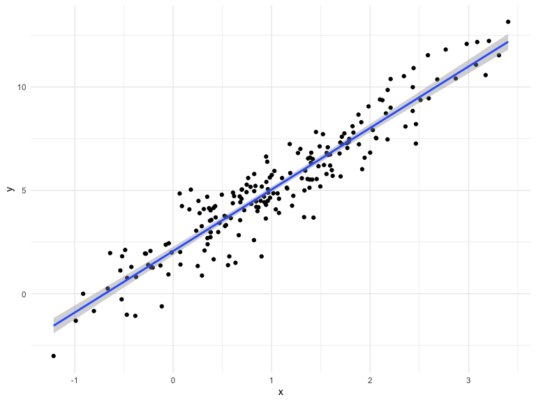
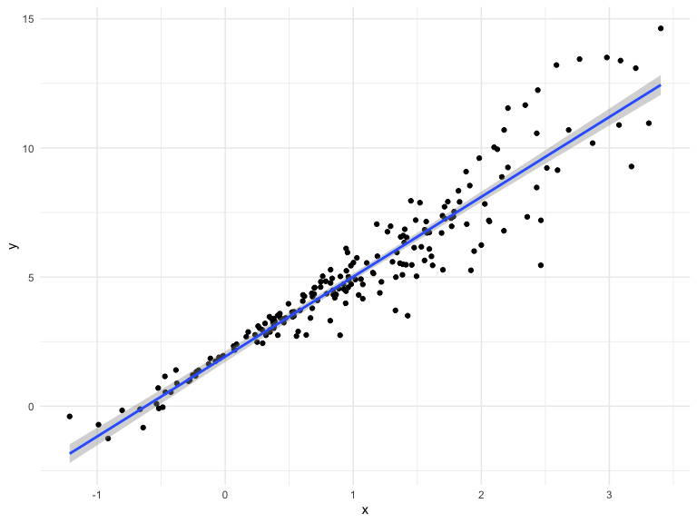
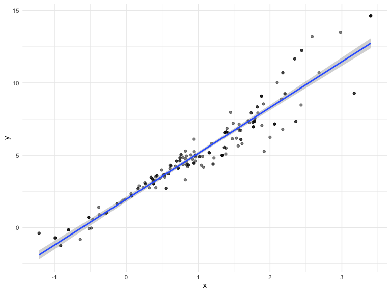
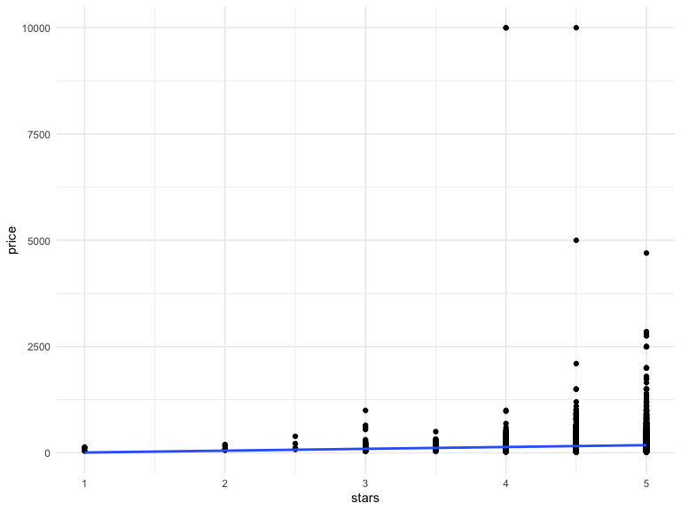
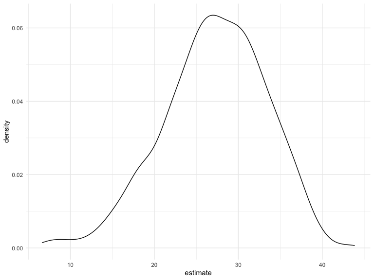

Bootstrapping
================
Chhiring Lama
2024-11-14

Getting started with bootstrapping

Lets make up some data

``` r
n_samp = 200

sim_df_constant <- tibble(x = rnorm(n_samp,1, 1), 
         error =rnorm(n_samp, 0, 1), 
         y = 2 + 3*x + error)
  

sim_df_nonconstant <- sim_df_constant |> 
  mutate(error = error*0.75*x, 
         y = 2 + 3*x + error)
```

Lets look at the dataset.

``` r
sim_df_constant |> 
  ggplot(aes(x=x, y =y)) +
  geom_point() +
  stat_smooth(method = "lm")
```

    ## `geom_smooth()` using formula = 'y ~ x'



``` r
sim_df_nonconstant |> 
  ggplot(aes(x=x, y =y)) +
  geom_point() +
  stat_smooth(method = "lm")
```

    ## `geom_smooth()` using formula = 'y ~ x'



Look at regression results

``` r
sim_df_constant |> 
  lm(y ~ x, data = _) |> 
  broom::tidy() |> 
  knitr::kable(digits = 3)
```

| term        | estimate | std.error | statistic | p.value |
|:------------|---------:|----------:|----------:|--------:|
| (Intercept) |    2.065 |     0.107 |    19.221 |       0 |
| x           |    2.977 |     0.077 |    38.515 |       0 |

``` r
sim_df_nonconstant |> 
  lm(y ~ x, data = _) |> 
  broom::tidy() |> 
  knitr::kable(digits = 3)
```

| term        | estimate | std.error | statistic | p.value |
|:------------|---------:|----------:|----------:|--------:|
| (Intercept) |    1.920 |     0.106 |    18.083 |       0 |
| x           |    3.094 |     0.076 |    40.492 |       0 |

Despite the very different error structures, standard errors for
coefficient estimates are similar in both cases!

We’ll use the bootstrap to make inference for the data on the right.
This is intended largely as an illustration for how to use the bootstrap
in cases where the theoretical distribution is “unknown”, although for
these data in particular weighted least squares could be more
appropriate.

## Draw a bootstrap sample

``` r
boot_sample <- function(df){
  boot_df = sample_frac(df, replace = TRUE) |> 
    arrange(x)
  return(boot_df)
}
```

Lets try running this

``` r
sim_df_nonconstant |> 
  boot_sample() |> 
  ggplot(aes(x=x, y =y)) +
  geom_point(alpha = 0.5) +
  stat_smooth(method = "lm")
```

    ## `geom_smooth()` using formula = 'y ~ x'


Each bootstrap gives us a slightly different fit.

Can we do this as part of an analysis? Yes

``` r
sim_df_nonconstant |> 
  boot_sample() |> 
  lm(y ~ x, data = _) |> 
  broom::tidy() |> 
  knitr::kable(digits = 3)
```

| term        | estimate | std.error | statistic | p.value |
|:------------|---------:|----------:|----------:|--------:|
| (Intercept) |    1.925 |     0.116 |    16.658 |       0 |
| x           |    3.072 |     0.082 |    37.631 |       0 |

We can save the estimated values in each bootstrap sampling

``` r
boot_straps <- tibble(
  strap_number = 1:1000
) |> 
  mutate(
    strap_sample = map(strap_number, \(i) boot_sample(df = sim_df_nonconstant)), 
    models = map(strap_sample, \(df) lm(y ~ x, data = df)), 
    results = map(models, broom::tidy)
  )

bootstrap_results <- boot_straps |> 
  select(strap_number, results) |> 
  unnest(results) |> 
  group_by(term) |> 
  summarise(
    boot_se = sd(estimate)
  )
```

We can try it for the sample where the assumptions are not violated
(`sim_df_constant`). We get the same SE in both, meaning bootstrapping
holds the theory of large numbers for both sample adhering to and
violating the normality assumption.

## Do this using modelr

``` r
boot_straps <- sim_df_nonconstant |> 
  modelr::bootstrap(1000) |> 
  mutate(strap = map(strap, as_tibble), 
         models = map(strap, \(df) lm(y ~ x, data = df)), 
    results = map(models, broom::tidy)) |> 
  select(.id, results) |> 
  unnest(results)
```

## What do you want to report

``` r
boot_straps |> 
  summarise(boot_se = sd(estimate), 
            boot_est = mean(estimate), 
            boot_ci_ll = quantile(estimate, 0.025), 
            boot_ci_ul = quantile(estimate, 0.975))
```

    ## # A tibble: 1 × 4
    ##   boot_se boot_est boot_ci_ll boot_ci_ul
    ##     <dbl>    <dbl>      <dbl>      <dbl>
    ## 1   0.591     2.51       1.81       3.25

## Airbnb

``` r
data("nyc_airbnb")

manhattan_airbnb <-  
  nyc_airbnb |> 
  mutate(stars = review_scores_location / 2) |> 
  rename(borough = neighbourhood_group,
    neighborhood = neighbourhood) |> 
  filter(borough == "Manhattan") |> 
  select(price, stars, borough, neighborhood, room_type) |> 
  drop_na()
```

plot the data

``` r
manhattan_airbnb |> 
  ggplot(aes(x = stars, y = price)) +
  geom_point() +
  stat_smooth(method = "lm", se = FALSE)
```

    ## `geom_smooth()` using formula = 'y ~ x'



Fit a regression

``` r
manhattan_airbnb |> 
  lm(price ~ stars + room_type, data = _) |> 
  broom::tidy()
```

    ## # A tibble: 4 × 5
    ##   term                  estimate std.error statistic   p.value
    ##   <chr>                    <dbl>     <dbl>     <dbl>     <dbl>
    ## 1 (Intercept)               95.7     22.2       4.31 1.62e-  5
    ## 2 stars                     27.1      4.59      5.91 3.45e-  9
    ## 3 room_typePrivate room   -124.       3.46    -35.8  9.40e-270
    ## 4 room_typeShared room    -154.      10.1     -15.3  2.47e- 52

Bootstrap for better inference?

``` r
bootstrap_results <- manhattan_airbnb |> 
  modelr::bootstrap(1000) |> 
  mutate(
    strap = map(strap, as_tibble), 
    models = map(strap, \(df) lm(price ~ stars + room_type, data = df)), 
    results = map(models, broom::tidy)
  ) |> 
  select(.id, results) |> 
  unnest(results)
```

``` r
bootstrap_results |> 
  filter(term == "stars") |> 
  ggplot(aes(x = estimate)) +
  geom_density()
```



``` r
bootstrap_results |> 
  summarise(boot_se = sd(estimate), 
            boot_est = mean(estimate), 
            boot_ci_ll = quantile(estimate, 0.025), 
            boot_ci_ul = quantile(estimate, 0.975))
```

    ## # A tibble: 1 × 4
    ##   boot_se boot_est boot_ci_ll boot_ci_ul
    ##     <dbl>    <dbl>      <dbl>      <dbl>
    ## 1    105.    -38.9      -157.       136.
