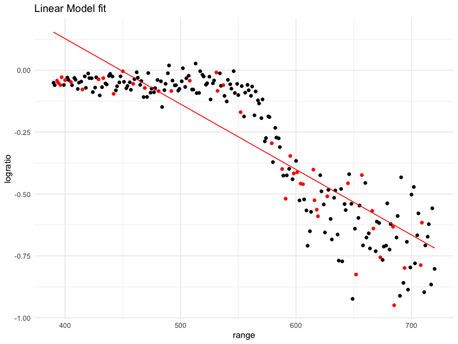
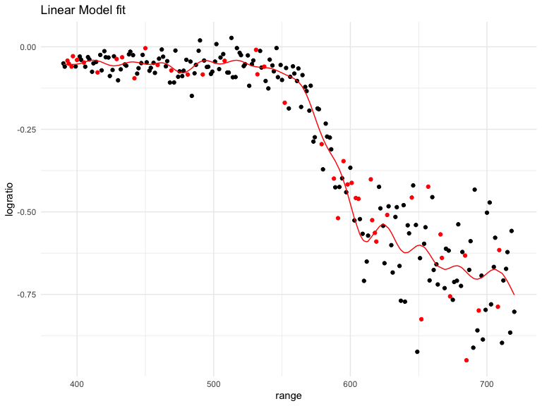

Cross Validation
================
Chhiring Lama
2024-11-19

Look at LIDAR data

``` r
data("lidar")

lidar_df <- lidar |> 
  as_tibble() |> 
  mutate(id = row_number())
```

``` r
lidar_df |> 
  ggplot(aes(x = range, y = logratio)) + 
  geom_point()
```


## Try to do CV

Compare 3 models = one Linear, one smooth and one wiggly

Construct training and testing datasets

``` r
train_df <- sample_frac(
  lidar_df, 
  size = .8
)

test_df <- anti_join(lidar_df, train_df, by = "id")
```

Look at these

``` r
train_df |> 
  ggplot(aes(x = range, y = logratio)) + 
  geom_point()+
  geom_point(data = test_df, color = "red")
```


Fit the 3 models

``` r
linear_model = lm(logratio ~ range, data = train_df)
smooth_model = gam(logratio ~ s(range), data = train_df)
wiggly_model = gam(logratio ~ s(range, k = 30), data = train_df, sp = 10e-6)
```

Look at the fits

``` r
train_df |> 
  add_predictions(linear_model) |> 
  ggplot(aes(x = range, y = logratio)) + 
  geom_point()+
  geom_line(aes(y = pred), color = "red") +
  geom_point(data = test_df, color = "red")+
  labs(title = "Linear Model fit")
```



``` r
train_df |> 
  add_predictions(wiggly_model) |> 
  ggplot(aes(x = range, y = logratio)) + 
  geom_point()+
  geom_line(aes(y = pred), color = "red") +
  geom_point(data = test_df, color = "red")+
  labs(title = "Linear Model fit")
```



``` r
train_df |> 
  add_predictions(smooth_model) |> 
  ggplot(aes(x = range, y = logratio)) + 
  geom_point()+
  geom_line(aes(y = pred), color = "red") +
  geom_point(data = test_df, color = "red")+
  labs(title = "Linear Model fit")
```


Compare them numerically using RMSE

``` r
rmse(linear_model, test_df)
```

    ## [1] 0.127317

``` r
rmse(smooth_model, test_df)
```

    ## [1] 0.08302008

``` r
rmse(wiggly_model, test_df)
```

    ## [1] 0.08848557

Small difference between smooth and wiggly model. Will this be
consistent if we use different training and testing data

## Repeat the train/test split

``` r
cv_df <- crossv_mc(lidar_df, 100)

cv_df |>  
  pull(train) |>
  nth(3) |> 
  as_tibble()
```

    ## # A tibble: 176 × 3
    ##    range logratio    id
    ##    <int>    <dbl> <int>
    ##  1   390  -0.0504     1
    ##  2   391  -0.0601     2
    ##  3   393  -0.0419     3
    ##  4   394  -0.0510     4
    ##  5   396  -0.0599     5
    ##  6   399  -0.0596     7
    ##  7   400  -0.0399     8
    ##  8   402  -0.0294     9
    ##  9   403  -0.0395    10
    ## 10   405  -0.0476    11
    ## # ℹ 166 more rows

``` r
cv_res_df <- cv_df |> 
  mutate(
    linear_mod = map(train, \(x) lm(logratio ~ range, data = x)), 
    smooth_mod = map(train, \(x) gam(logratio ~ s(range), data = x)), 
    wiggly_mod = map(train, \(x) gam(logratio ~ s(range, k = 30), sp = 10e-6, data = x))
  ) |> 
  mutate(
    rmse_linear = map2_dbl(linear_mod, test, rmse), 
    rmse_smooth = map2_dbl(smooth_mod, test, rmse), 
    rmse_wiggly = map2_dbl(wiggly_mod, test, rmse)
  )
```

``` r
cv_res_df |> 
  select(starts_with("rmse"))  |> 
  pivot_longer(
    everything(),
    names_to = "model_type", 
    values_to = "rmse"
  ) |> 
  ggplot(aes(x = model_type, y = rmse)) +
  geom_violin()
```


Smooth model has the least RMSE. So, this seems to be the best fit
