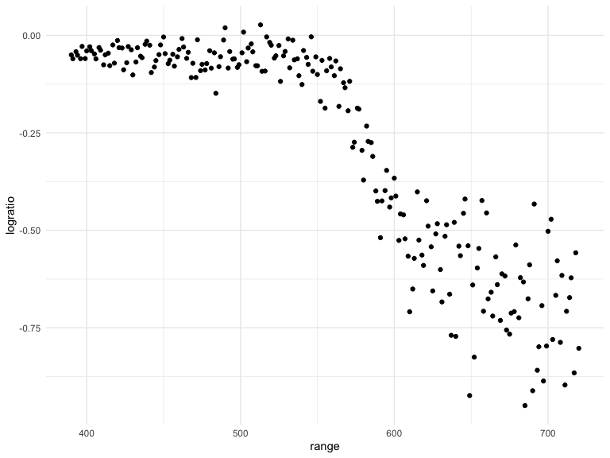
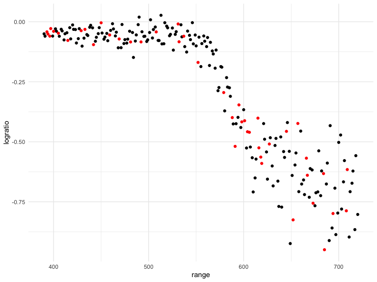

Cross Validation
================
Chhiring Lama
2024-11-19

Look at LIDAR data

``` r
data("lidar")

lidar_df <- lidar |> 
  as_tibble() |> 
  mutate(id = row_number())
```

``` r
lidar_df |> 
  ggplot(aes(x = range, y = logratio)) + 
  geom_point()
```



## Try to do CV

Compare 3 models = one Linear, one smooth and one wiggly

Construct training and testing datasets

``` r
train_df <- sample_frac(
  lidar_df, 
  size = .8
)

test_df <- anti_join(lidar_df, train_df, by = "id")
```

Look at these

``` r
train_df |> 
  ggplot(aes(x = range, y = logratio)) + 
  geom_point()+
  geom_point(data = test_df, color = "red")
```


