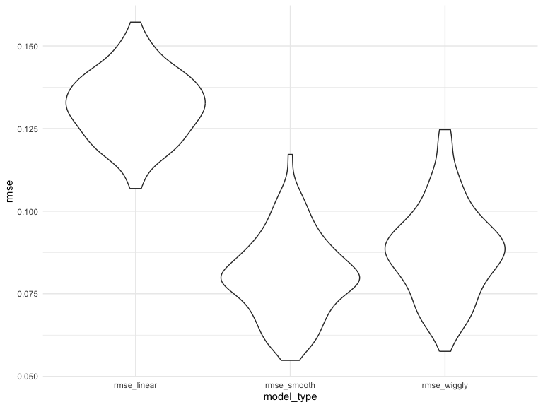
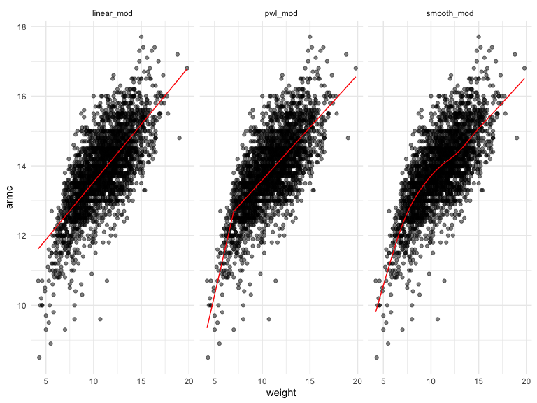

Cross Validation
================
Chhiring Lama
2024-11-19

Look at LIDAR data

``` r
data("lidar")

lidar_df <- lidar |> 
  as_tibble() |> 
  mutate(id = row_number())
```

``` r
lidar_df |> 
  ggplot(aes(x = range, y = logratio)) + 
  geom_point()
```


## Try to do CV

Compare 3 models = one Linear, one smooth and one wiggly

Construct training and testing datasets

``` r
train_df <- sample_frac(
  lidar_df, 
  size = .8
)

test_df <- anti_join(lidar_df, train_df, by = "id")
```

Look at these

``` r
train_df |> 
  ggplot(aes(x = range, y = logratio)) + 
  geom_point()+
  geom_point(data = test_df, color = "red")
```


Fit the 3 models

``` r
linear_mod = lm(logratio ~ range, data = train_df)
smooth_mod = gam(logratio ~ s(range), data = train_df)
wiggly_mod = gam(logratio ~ s(range, k = 30), data = train_df, sp = 10e-6)
```

Look at the fits

``` r
train_df |> 
  add_predictions(linear_mod) |> 
  ggplot(aes(x = range, y = logratio)) + 
  geom_point()+
  geom_line(aes(y = pred), color = "red") +
  geom_point(data = test_df, color = "red")+
  labs(title = "Linear Model fit")
```


``` r
train_df |> 
  add_predictions(wiggly_mod) |> 
  ggplot(aes(x = range, y = logratio)) + 
  geom_point()+
  geom_line(aes(y = pred), color = "red") +
  geom_point(data = test_df, color = "red")+
  labs(title = "Linear Model fit")
```


``` r
train_df |> 
  add_predictions(smooth_mod) |> 
  ggplot(aes(x = range, y = logratio)) + 
  geom_point()+
  geom_line(aes(y = pred), color = "red") +
  geom_point(data = test_df, color = "red")+
  labs(title = "Linear Model fit")
```


Compare them numerically using RMSE

``` r
rmse(linear_mod, test_df)
```

    ## [1] 0.127317

``` r
rmse(smooth_mod, test_df)
```

    ## [1] 0.08302008

``` r
rmse(wiggly_mod, test_df)
```

    ## [1] 0.08848557

Small difference between smooth and wiggly model. Will this be
consistent if we use different training and testing data

## Repeat the train/test split

``` r
cv_df <- crossv_mc(lidar_df, 100) |> 
  mutate(
    train = map(train, as_tibble),
    test = map(test, as_tibble))

cv_df |>  
  pull(train) |>
  nth(3) |> 
  as_tibble()
```

    ## # A tibble: 176 × 3
    ##    range logratio    id
    ##    <int>    <dbl> <int>
    ##  1   390  -0.0504     1
    ##  2   391  -0.0601     2
    ##  3   393  -0.0419     3
    ##  4   394  -0.0510     4
    ##  5   396  -0.0599     5
    ##  6   399  -0.0596     7
    ##  7   400  -0.0399     8
    ##  8   402  -0.0294     9
    ##  9   403  -0.0395    10
    ## 10   405  -0.0476    11
    ## # ℹ 166 more rows

``` r
cv_res_df <- cv_df |> 
  mutate(
    linear_mod = map(train, \(x) lm(logratio ~ range, data = x)), 
    smooth_mod = map(train, \(x) gam(logratio ~ s(range), data = x)), 
    wiggly_mod = map(train, \(x) gam(logratio ~ s(range, k = 30), sp = 10e-6, data = x))
  ) |> 
  mutate(
    rmse_linear = map2_dbl(linear_mod, test, rmse), 
    rmse_smooth = map2_dbl(smooth_mod, test, rmse), 
    rmse_wiggly = map2_dbl(wiggly_mod, test, rmse)
  )
```

``` r
cv_res_df |> 
  select(starts_with("rmse"))  |> 
  pivot_longer(
    everything(),
    names_to = "model_type", 
    values_to = "rmse"
  ) |> 
  ggplot(aes(x = model_type, y = rmse)) +
  geom_violin()
```



Smooth model has the least RMSE. So, this seems to be the best fit.

## Example: Child Growth

Import Nepalese children dataset

``` r
child_df <- read_csv("data/nepalese_children.csv") |> 
  mutate(
    weight_cp7 = (weight > 7) * (weight - 7)
  )
```

    ## Rows: 2705 Columns: 5
    ## ── Column specification ────────────────────────────────────────────────────────
    ## Delimiter: ","
    ## dbl (5): age, sex, weight, height, armc
    ## 
    ## ℹ Use `spec()` to retrieve the full column specification for this data.
    ## ℹ Specify the column types or set `show_col_types = FALSE` to quiet this message.

Look at the data

``` r
ggplot(child_df, aes(x = weight, y = armc)) +
  geom_point(alpha = 0.5)
```


Fit some models

``` r
linear_mod = lm(armc ~ weight, data = child_df)
pwl_mod = lm(armc ~ weight + weight_cp7, data = child_df)
smooth_mod = gam(armc ~ s(weight), data = child_df)
```

``` r
child_df |> 
  gather_predictions(linear_mod, pwl_mod, smooth_mod) |> 
  mutate(model = fct_inorder(model)) |> 
  ggplot(aes(x = weight, y = armc)) + 
  geom_point(alpha = .5) +
  geom_line(aes(y = pred), color = "red") + 
  facet_grid(~model)
```



CV to select models

``` r
cv_df <- crossv_mc(child_df, 100) |> 
  mutate(
    train = map(train, as_tibble),
    test = map(test, as_tibble))
  

cv_res_df <- cv_df |> 
  mutate(
    linear_mod = map(train, \(x) lm(armc ~ weight, data = x)), 
    smooth_mod = map(train, \(x) gam(armc ~ s(weight), data = x)), 
    pwl_mod = map(train, \(x) lm(armc ~ weight + weight_cp7, data = x))
  ) |> 
  mutate(
    rmse_linear = map2_dbl(linear_mod, test, rmse), 
    rmse_smooth = map2_dbl(smooth_mod, test, rmse), 
    rmse_pwl = map2_dbl(pwl_mod, test, rmse)
  )
```

``` r
cv_res_df |> 
  select(starts_with("rmse"))  |> 
  pivot_longer(
    everything(),
    names_to = "model_type", 
    values_to = "rmse"
  ) |> 
  ggplot(aes(x = model_type, y = rmse)) +
  geom_violin()
```


Notes: Based on these results, there’s clearly some improvement in
predictive accuracy gained by allowing non-linearity – whether this is
sufficient to justify a more complex model isn’t obvious, though. Among
the non-linear models, the smooth fit from gam might be a bit better
than the piecewise linear model. Which candidate model is best, though,
depends a bit on the need to balance complexity with goodness of fit and
interpretability. In the end, I’d probably go with the piecewise linear
model – the non-linearity is clear enough that it should be accounted
for, and the differences between the piecewise and gam fits are small
enough that the easy interpretation of the piecewise model “wins”.
