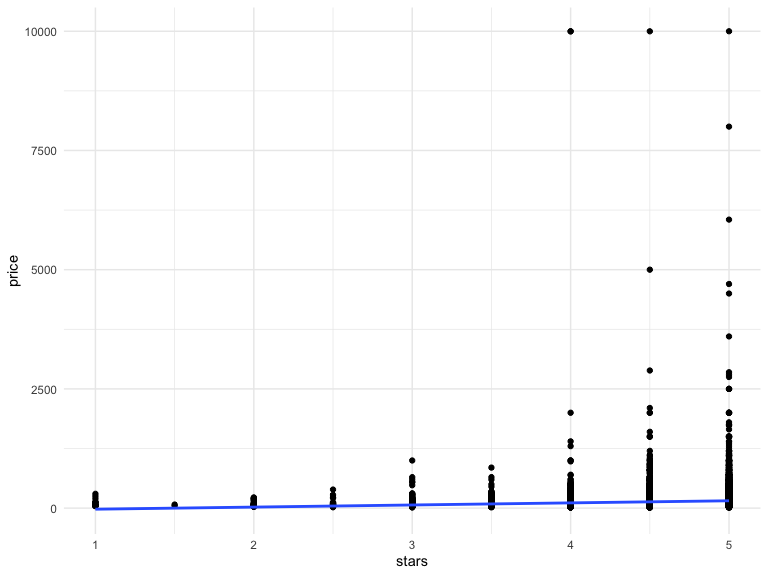
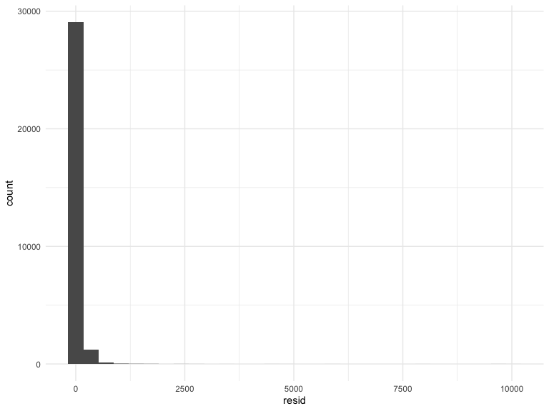
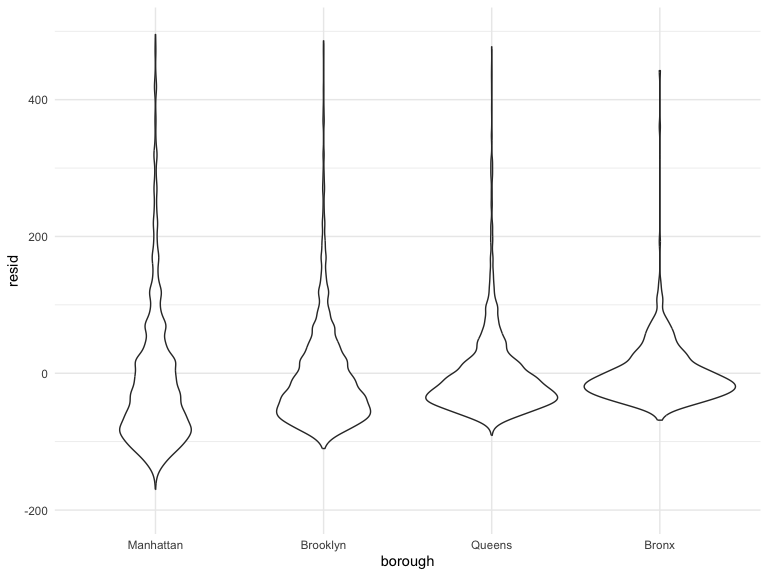
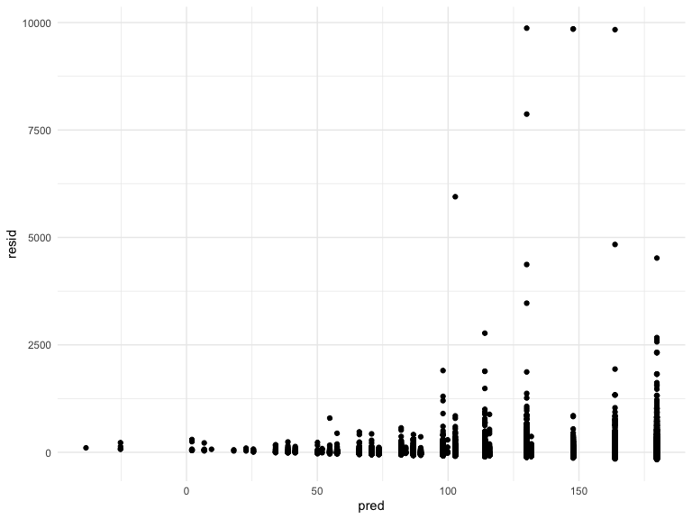

linear_models
================
Chhiring Lama
2024-11-07

Import the dataset and do some data cleaning:

``` r
data("nyc_airbnb")

nyc_airbnb <-  
  nyc_airbnb |> 
  mutate(stars = review_scores_location / 2) |> 
  rename(borough = neighbourhood_group,
    neighborhood = neighbourhood) |> 
  filter(borough != "Staten Island") |> 
  select(price, stars, borough, neighborhood, room_type) |> 
  mutate(borough = fct_infreq(borough), 
         room_type = fct_infreq(room_type))
```

Fit linear regression to predict price using stars and borough

Relatively simple:

``` r
fit <- lm(price ~ stars + borough, data = nyc_airbnb)

summary(fit)
```

    ## 
    ## Call:
    ## lm(formula = price ~ stars + borough, data = nyc_airbnb)
    ## 
    ## Residuals:
    ##    Min     1Q Median     3Q    Max 
    ## -169.8  -64.0  -29.0   20.2 9870.0 
    ## 
    ## Coefficients:
    ##                 Estimate Std. Error t value Pr(>|t|)    
    ## (Intercept)       19.839     12.189   1.628    0.104    
    ## stars             31.990      2.527  12.657   <2e-16 ***
    ## boroughBrooklyn  -49.754      2.235 -22.262   <2e-16 ***
    ## boroughQueens    -77.048      3.727 -20.675   <2e-16 ***
    ## boroughBronx     -90.254      8.567 -10.534   <2e-16 ***
    ## ---
    ## Signif. codes:  0 '***' 0.001 '**' 0.01 '*' 0.05 '.' 0.1 ' ' 1
    ## 
    ## Residual standard error: 181.5 on 30525 degrees of freedom
    ##   (9962 observations deleted due to missingness)
    ## Multiple R-squared:  0.03423,    Adjusted R-squared:  0.03411 
    ## F-statistic: 270.5 on 4 and 30525 DF,  p-value: < 2.2e-16

``` r
names(summary(fit))
```

    ##  [1] "call"          "terms"         "residuals"     "coefficients" 
    ##  [5] "aliased"       "sigma"         "df"            "r.squared"    
    ##  [9] "adj.r.squared" "fstatistic"    "cov.unscaled"  "na.action"

``` r
coef(fit)
```

    ##     (Intercept)           stars boroughBrooklyn   boroughQueens    boroughBronx 
    ##        19.83946        31.98989       -49.75363       -77.04776       -90.25393

``` r
fit |> 
  broom::tidy() |> 
  select(term, estimate, `p.value`)
```

    ## # A tibble: 5 × 3
    ##   term            estimate   p.value
    ##   <chr>              <dbl>     <dbl>
    ## 1 (Intercept)         19.8 1.04e-  1
    ## 2 stars               32.0 1.27e- 36
    ## 3 boroughBrooklyn    -49.8 6.32e-109
    ## 4 boroughQueens      -77.0 2.58e- 94
    ## 5 boroughBronx       -90.3 6.64e- 26

``` r
fit |> 
  broom::glance()
```

    ## # A tibble: 1 × 12
    ##   r.squared adj.r.squared sigma statistic   p.value    df   logLik    AIC    BIC
    ##       <dbl>         <dbl> <dbl>     <dbl>     <dbl> <dbl>    <dbl>  <dbl>  <dbl>
    ## 1    0.0342        0.0341  182.      271. 6.73e-229     4 -202113. 4.04e5 4.04e5
    ## # ℹ 3 more variables: deviance <dbl>, df.residual <int>, nobs <int>

Try a more complex model

``` r
fit <- lm(price ~ stars + borough, data = nyc_airbnb)

fit |> 
  broom::tidy() |> 
  select(term, estimate, `p.value`) |> 
  mutate(term = str_replace(term, "borough", "Borough:")) |> 
  knitr::kable(digits = 3)
```

| term             | estimate | p.value |
|:-----------------|---------:|--------:|
| (Intercept)      |   19.839 |   0.104 |
| stars            |   31.990 |   0.000 |
| Borough:Brooklyn |  -49.754 |   0.000 |
| Borough:Queens   |  -77.048 |   0.000 |
| Borough:Bronx    |  -90.254 |   0.000 |

## Some diagnostics

(backtrack to some EDA)

``` r
nyc_airbnb |> 
  ggplot(aes(y = price, x = stars)) +
  geom_point() +
  stat_smooth(method = "lm")
```

    ## `geom_smooth()` using formula = 'y ~ x'



Most diagnostics use residuals

``` r
modelr::add_residuals(nyc_airbnb, fit) |> 
  ggplot(aes(x = resid)) +
  geom_histogram()
```

    ## `stat_bin()` using `bins = 30`. Pick better value with `binwidth`.



``` r
modelr::add_residuals(nyc_airbnb, fit) |> 
  ggplot(aes(x = borough, y = resid)) +
  geom_violin() +
  ylim(-200, 500)
```



Residuals against stars

``` r
modelr::add_residuals(nyc_airbnb, fit) |> 
  ggplot(aes(x = stars, y = resid)) +
  geom_point()
```


Residuals against fitted values

``` r
nyc_airbnb |> 
  modelr::add_residuals(fit) |> 
  modelr::add_predictions(fit) |> 
  ggplot(aes(x = pred, y = resid)) +
  geom_point()
```


