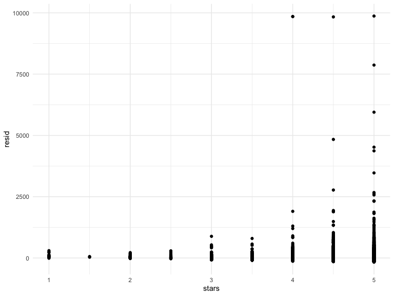

linear_models
================
Chhiring Lama
2024-11-07

Import the dataset and do some data cleaning:

``` r
data("nyc_airbnb")

nyc_airbnb <-  
  nyc_airbnb |> 
  mutate(stars = review_scores_location / 2) |> 
  rename(borough = neighbourhood_group,
    neighborhood = neighbourhood) |> 
  filter(borough != "Staten Island") |> 
  select(price, stars, borough, neighborhood, room_type) |> 
  mutate(borough = fct_infreq(borough), 
         room_type = fct_infreq(room_type))
```

Fit linear regression to predict price using stars and borough

Relatively simple:

``` r
fit <- lm(price ~ stars + borough, data = nyc_airbnb)

summary(fit)
```

    ## 
    ## Call:
    ## lm(formula = price ~ stars + borough, data = nyc_airbnb)
    ## 
    ## Residuals:
    ##    Min     1Q Median     3Q    Max 
    ## -169.8  -64.0  -29.0   20.2 9870.0 
    ## 
    ## Coefficients:
    ##                 Estimate Std. Error t value Pr(>|t|)    
    ## (Intercept)       19.839     12.189   1.628    0.104    
    ## stars             31.990      2.527  12.657   <2e-16 ***
    ## boroughBrooklyn  -49.754      2.235 -22.262   <2e-16 ***
    ## boroughQueens    -77.048      3.727 -20.675   <2e-16 ***
    ## boroughBronx     -90.254      8.567 -10.534   <2e-16 ***
    ## ---
    ## Signif. codes:  0 '***' 0.001 '**' 0.01 '*' 0.05 '.' 0.1 ' ' 1
    ## 
    ## Residual standard error: 181.5 on 30525 degrees of freedom
    ##   (9962 observations deleted due to missingness)
    ## Multiple R-squared:  0.03423,    Adjusted R-squared:  0.03411 
    ## F-statistic: 270.5 on 4 and 30525 DF,  p-value: < 2.2e-16

``` r
names(summary(fit))
```

    ##  [1] "call"          "terms"         "residuals"     "coefficients" 
    ##  [5] "aliased"       "sigma"         "df"            "r.squared"    
    ##  [9] "adj.r.squared" "fstatistic"    "cov.unscaled"  "na.action"

``` r
coef(fit)
```

    ##     (Intercept)           stars boroughBrooklyn   boroughQueens    boroughBronx 
    ##        19.83946        31.98989       -49.75363       -77.04776       -90.25393

``` r
fit |> 
  broom::tidy() |> 
  select(term, estimate, `p.value`)
```

    ## # A tibble: 5 × 3
    ##   term            estimate   p.value
    ##   <chr>              <dbl>     <dbl>
    ## 1 (Intercept)         19.8 1.04e-  1
    ## 2 stars               32.0 1.27e- 36
    ## 3 boroughBrooklyn    -49.8 6.32e-109
    ## 4 boroughQueens      -77.0 2.58e- 94
    ## 5 boroughBronx       -90.3 6.64e- 26

``` r
fit |> 
  broom::glance()
```

    ## # A tibble: 1 × 12
    ##   r.squared adj.r.squared sigma statistic   p.value    df   logLik    AIC    BIC
    ##       <dbl>         <dbl> <dbl>     <dbl>     <dbl> <dbl>    <dbl>  <dbl>  <dbl>
    ## 1    0.0342        0.0341  182.      271. 6.73e-229     4 -202113. 4.04e5 4.04e5
    ## # ℹ 3 more variables: deviance <dbl>, df.residual <int>, nobs <int>

Try a more complex model

``` r
fit <- lm(price ~ stars + borough, data = nyc_airbnb)

fit |> 
  broom::tidy() |> 
  select(term, estimate, `p.value`) |> 
  mutate(term = str_replace(term, "borough", "Borough:")) |> 
  knitr::kable(digits = 3)
```

| term             | estimate | p.value |
|:-----------------|---------:|--------:|
| (Intercept)      |   19.839 |   0.104 |
| stars            |   31.990 |   0.000 |
| Borough:Brooklyn |  -49.754 |   0.000 |
| Borough:Queens   |  -77.048 |   0.000 |
| Borough:Bronx    |  -90.254 |   0.000 |

## Some diagnostics

(backtrack to some EDA)

``` r
nyc_airbnb |> 
  ggplot(aes(y = price, x = stars)) +
  geom_point() +
  stat_smooth(method = "lm")
```

    ## `geom_smooth()` using formula = 'y ~ x'


Most diagnostics use residuals

``` r
modelr::add_residuals(nyc_airbnb, fit) |> 
  ggplot(aes(x = resid)) +
  geom_histogram()
```

    ## `stat_bin()` using `bins = 30`. Pick better value with `binwidth`.


``` r
modelr::add_residuals(nyc_airbnb, fit) |> 
  ggplot(aes(x = borough, y = resid)) +
  geom_violin() +
  ylim(-200, 500)
```


Residuals against stars

``` r
modelr::add_residuals(nyc_airbnb, fit) |> 
  ggplot(aes(x = stars, y = resid)) +
  geom_point()
```



Residuals against fitted values

``` r
nyc_airbnb |> 
  modelr::add_residuals(fit) |> 
  modelr::add_predictions(fit) |> 
  ggplot(aes(x = pred, y = resid)) +
  geom_point()
```


## Hypothesis Testing

For single coefficient, at the table

``` r
fit |> 
  broom::tidy()
```

    ## # A tibble: 5 × 5
    ##   term            estimate std.error statistic   p.value
    ##   <chr>              <dbl>     <dbl>     <dbl>     <dbl>
    ## 1 (Intercept)         19.8     12.2       1.63 1.04e-  1
    ## 2 stars               32.0      2.53     12.7  1.27e- 36
    ## 3 boroughBrooklyn    -49.8      2.23    -22.3  6.32e-109
    ## 4 boroughQueens      -77.0      3.73    -20.7  2.58e- 94
    ## 5 boroughBronx       -90.3      8.57    -10.5  6.64e- 26

When adding more than one coeff, use anova(),

``` r
fit_null <- lm(price ~ stars + borough, data = nyc_airbnb)
fit_alt <- lm(price ~ stars + borough + room_type, data = nyc_airbnb)
```

Look at both

``` r
fit_null |> 
  broom::tidy()
```

    ## # A tibble: 5 × 5
    ##   term            estimate std.error statistic   p.value
    ##   <chr>              <dbl>     <dbl>     <dbl>     <dbl>
    ## 1 (Intercept)         19.8     12.2       1.63 1.04e-  1
    ## 2 stars               32.0      2.53     12.7  1.27e- 36
    ## 3 boroughBrooklyn    -49.8      2.23    -22.3  6.32e-109
    ## 4 boroughQueens      -77.0      3.73    -20.7  2.58e- 94
    ## 5 boroughBronx       -90.3      8.57    -10.5  6.64e- 26

``` r
fit_alt |> 
  broom::tidy()
```

    ## # A tibble: 7 × 5
    ##   term                  estimate std.error statistic  p.value
    ##   <chr>                    <dbl>     <dbl>     <dbl>    <dbl>
    ## 1 (Intercept)              113.      11.8       9.54 1.56e-21
    ## 2 stars                     21.9      2.43      9.01 2.09e-19
    ## 3 boroughBrooklyn          -40.3      2.15    -18.8  4.62e-78
    ## 4 boroughQueens            -55.5      3.59    -15.4  1.32e-53
    ## 5 boroughBronx             -63.0      8.22     -7.67 1.76e-14
    ## 6 room_typePrivate room   -105.       2.05    -51.2  0       
    ## 7 room_typeShared room    -129.       6.15    -21.0  2.24e-97

``` r
anova(fit_null, fit_alt) |> 
  broom::tidy()
```

    ## # A tibble: 2 × 7
    ##   term                        df.residual    rss    df   sumsq statistic p.value
    ##   <chr>                             <dbl>  <dbl> <dbl>   <dbl>     <dbl>   <dbl>
    ## 1 price ~ stars + borough           30525 1.01e9    NA NA            NA       NA
    ## 2 price ~ stars + borough + …       30523 9.21e8     2  8.42e7     1394.       0

## Do effects differ across boroughs

First, use a lot of interactions

``` r
nyc_airbnb |> 
  lm(price ~ stars + borough + room_type*borough, data = _) |> 
  broom::tidy()
```

    ## # A tibble: 13 × 5
    ##    term                                  estimate std.error statistic  p.value
    ##    <chr>                                    <dbl>     <dbl>     <dbl>    <dbl>
    ##  1 (Intercept)                              121.      11.8      10.3  1.01e-24
    ##  2 stars                                     21.8      2.42      8.97 3.06e-19
    ##  3 boroughBrooklyn                          -55.5      2.94    -18.9  2.81e-79
    ##  4 boroughQueens                            -86.7      5.66    -15.3  1.09e-52
    ##  5 boroughBronx                            -108.      14.9      -7.27 3.78e-13
    ##  6 room_typePrivate room                   -125.       2.99    -41.7  0       
    ##  7 room_typeShared room                    -154.       8.69    -17.7  9.81e-70
    ##  8 boroughBrooklyn:room_typePrivate room     32.4      4.31      7.51 5.97e-14
    ##  9 boroughQueens:room_typePrivate room       56.0      7.44      7.52 5.60e-14
    ## 10 boroughBronx:room_typePrivate room        71.6     18.0       3.98 7.03e- 5
    ## 11 boroughBrooklyn:room_typeShared room      48.1     13.9       3.46 5.34e- 4
    ## 12 boroughQueens:room_typeShared room        60.7     17.9       3.40 6.72e- 4
    ## 13 boroughBronx:room_typeShared room         85.4     42.4       2.01 4.41e- 2

Strong interaction between borough and room type. But, we dont the
situation in manhattan and roomtypes.

Could fit separate models.

``` r
nyc_airbnb |> 
  filter(borough == "Manhattan") |> 
  lm(price ~ stars + room_type, data = _) |> 
  broom::tidy()
```

    ## # A tibble: 4 × 5
    ##   term                  estimate std.error statistic   p.value
    ##   <chr>                    <dbl>     <dbl>     <dbl>     <dbl>
    ## 1 (Intercept)               95.7     22.2       4.31 1.62e-  5
    ## 2 stars                     27.1      4.59      5.91 3.45e-  9
    ## 3 room_typePrivate room   -124.       3.46    -35.8  9.40e-270
    ## 4 room_typeShared room    -154.      10.1     -15.3  2.47e- 52

Within, Manhattan, strong association with roomtypes for price.

``` r
nyc_airbnb |> 
  filter(borough == "Brooklyn") |> 
  lm(price ~ stars + room_type, data = _) |> 
  broom::tidy()
```

    ## # A tibble: 4 × 5
    ##   term                  estimate std.error statistic   p.value
    ##   <chr>                    <dbl>     <dbl>     <dbl>     <dbl>
    ## 1 (Intercept)               69.6     14.0       4.96 7.27e-  7
    ## 2 stars                     21.0      2.98      7.05 1.90e- 12
    ## 3 room_typePrivate room    -92.2      2.72    -34.0  6.40e-242
    ## 4 room_typeShared room    -106.       9.43    -11.2  4.15e- 29

Similar observation here in Brooklyn too. Can check for the Bronx and
Queens too.

Get fancy and use list columns

``` r
nyc_airbnb |> 
  nest(data = -borough) |> 
  mutate(
    model = map(data, \(x) lm(price ~ stars + room_type, data = x)), 
    results = map(model, broom::tidy)
  ) |> 
  select(borough, results) |> 
  unnest(results) |> 
  select(borough, term, estimate) |> 
  pivot_wider(
    names_from = term, 
    values_from = estimate
  )
```

    ## # A tibble: 4 × 5
    ##   borough   `(Intercept)` stars `room_typePrivate room` `room_typeShared room`
    ##   <fct>             <dbl> <dbl>                   <dbl>                  <dbl>
    ## 1 Bronx              90.1  4.45                   -52.9                  -70.5
    ## 2 Queens             91.6  9.65                   -69.3                  -95.0
    ## 3 Brooklyn           69.6 21.0                    -92.2                 -106. 
    ## 4 Manhattan          95.7 27.1                   -124.                  -154.

What about room type across manhattan neighborhoods?

``` r
nyc_airbnb |> 
  filter(borough == "Manhattan", 
         neighborhood == "Chinatown") |> 
  lm(price ~ stars + room_type, data = _) |> 
  broom::tidy()
```

    ## # A tibble: 4 × 5
    ##   term                  estimate std.error statistic  p.value
    ##   <chr>                    <dbl>     <dbl>     <dbl>    <dbl>
    ## 1 (Intercept)              337.       60.4      5.59 5.66e- 8
    ## 2 stars                    -27.8      13.0     -2.14 3.34e- 2
    ## 3 room_typePrivate room   -109.       11.5     -9.52 1.03e-18
    ## 4 room_typeShared room    -143.       93.2     -1.54 1.25e- 1

``` r
nyc_airbnb |> 
  filter(borough == "Manhattan", 
         neighborhood == "Chelsea") |> 
  lm(price ~ stars + room_type, data = _) |> 
  broom::tidy()
```

    ## # A tibble: 4 × 5
    ##   term                  estimate std.error statistic  p.value
    ##   <chr>                    <dbl>     <dbl>     <dbl>    <dbl>
    ## 1 (Intercept)              477.      135.       3.53 4.38e- 4
    ## 2 stars                    -44.5      27.3     -1.63 1.04e- 1
    ## 3 room_typePrivate room   -133.       12.7    -10.5  2.13e-24
    ## 4 room_typeShared room    -153.       36.2     -4.24 2.49e- 5

Lets do this for all neighborhoods!

``` r
manhattan_neighborhood_fit_df <- nyc_airbnb |> 
  filter(borough == "Manhattan") |> 
  nest(data = -(borough:neighborhood)) |> 
  mutate(
    model = map(data, \(x) lm(price ~ stars + room_type, data = x)), 
    results = map(model, broom::tidy)
  ) |> 
  select(borough, neighborhood, results) |> 
  unnest(results) 
```

Look at the effect of the room type

``` r
manhattan_neighborhood_fit_df |> 
  filter(str_detect(term, "room_type")) |> 
  ggplot(aes(x = term, y = estimate)) +
  geom_boxplot()
```


``` r
nyc_airbnb |> 
  filter(neighborhood == "NoHo", 
         room_type == "Shared room")
```

    ## # A tibble: 1 × 5
    ##   price stars borough   neighborhood room_type  
    ##   <dbl> <dbl> <fct>     <chr>        <fct>      
    ## 1   219     4 Manhattan NoHo         Shared room

## Binary outcome

``` r
baltimore_df <-  
  read_csv("data/homicide-data.csv") |> 
  filter(city == "Baltimore") |> 
  mutate(
    resolved = as.numeric(disposition == "Closed by arrest"),
    victim_age = as.numeric(victim_age),
    victim_race = fct_relevel(victim_race, "White")) |> 
  select(resolved, victim_age, victim_race, victim_sex)
```

    ## Rows: 52179 Columns: 12
    ## ── Column specification ────────────────────────────────────────────────────────
    ## Delimiter: ","
    ## chr (9): uid, victim_last, victim_first, victim_race, victim_age, victim_sex...
    ## dbl (3): reported_date, lat, lon
    ## 
    ## ℹ Use `spec()` to retrieve the full column specification for this data.
    ## ℹ Specify the column types or set `show_col_types = FALSE` to quiet this message.

``` r
fit_logistic = 
  baltimore_df |> 
  glm(resolved ~ victim_age + victim_race + victim_sex, data = _, family = binomial()) 
```

``` r
fit_logistic |> 
  broom::tidy() |> 
  mutate(OR = exp(estimate)) |>
  select(term, log_OR = estimate, OR, p.value) |> 
  knitr::kable(digits = 3)
```

| term                | log_OR |    OR | p.value |
|:--------------------|-------:|------:|--------:|
| (Intercept)         |  1.190 | 3.287 |   0.000 |
| victim_age          | -0.007 | 0.993 |   0.027 |
| victim_raceAsian    |  0.296 | 1.345 |   0.653 |
| victim_raceBlack    | -0.842 | 0.431 |   0.000 |
| victim_raceHispanic | -0.265 | 0.767 |   0.402 |
| victim_raceOther    | -0.768 | 0.464 |   0.385 |
| victim_sexMale      | -0.880 | 0.415 |   0.000 |

We can also compute fitted values; similarly to the estimates in the
model summary, these are expressed as log odds and can be transformed to
produce probabilities for each subject.

``` r
baltimore_df |> 
  modelr::add_predictions(fit_logistic) |> 
  mutate(fitted_prob = boot::inv.logit(pred))
```

    ## # A tibble: 2,827 × 6
    ##    resolved victim_age victim_race victim_sex    pred fitted_prob
    ##       <dbl>      <dbl> <fct>       <chr>        <dbl>       <dbl>
    ##  1        0         17 Black       Male       -0.654        0.342
    ##  2        0         26 Black       Male       -0.720        0.327
    ##  3        0         21 Black       Male       -0.683        0.335
    ##  4        1         61 White       Male       -0.131        0.467
    ##  5        1         46 Black       Male       -0.864        0.296
    ##  6        1         27 Black       Male       -0.727        0.326
    ##  7        1         21 Black       Male       -0.683        0.335
    ##  8        1         16 Black       Male       -0.647        0.344
    ##  9        1         21 Black       Male       -0.683        0.335
    ## 10        1         44 Black       Female      0.0297       0.507
    ## # ℹ 2,817 more rows
